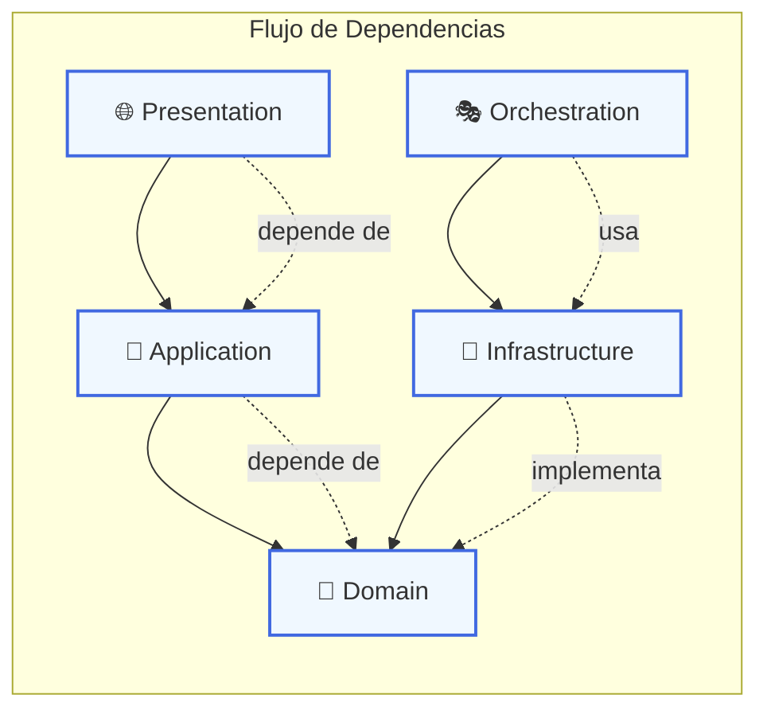
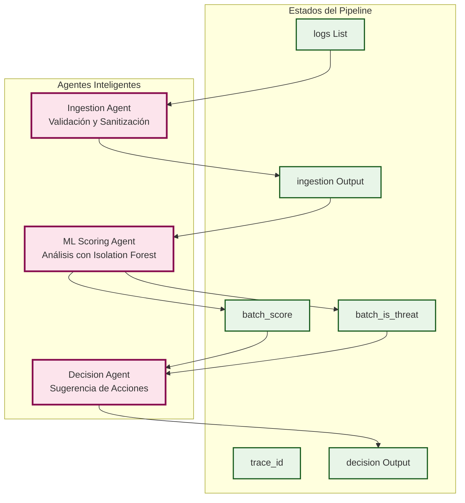
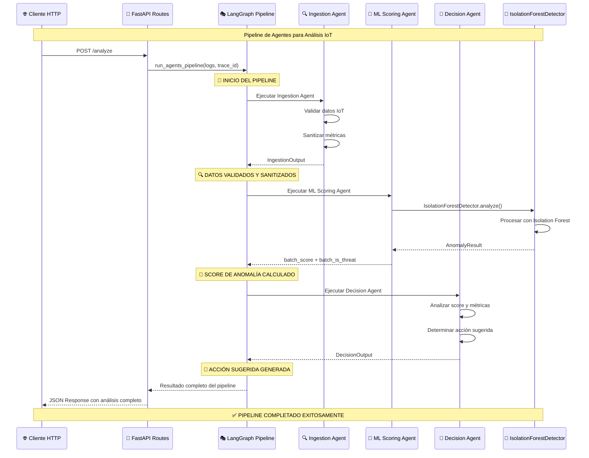

# 🔍 MeLiChallenge-SecurityIA: IoT Anomaly Detection API

API FastAPI con Clean Architecture para detección de anomalías en dispositivos IoT y sistemas inteligentes.

## **Dataset de IoT Anomaly Detection**

Este proyecto ha sido adaptado para trabajar con el dataset **"Anomaly Detection and Threat Intelligence Dataset"** de Kaggle, que contiene métricas de dispositivos IoT para la detección de anomalías y amenazas de seguridad.

### **Características del Dataset:**
- **10,000 registros** de dispositivos IoT
- **4 clases**: Normal, Anomaly_DoS, Anomaly_Injection, Anomaly_Spoofing
- **8 tipos de dispositivos**: thermostat, smart, sensor, camera, lock, hub, appliance, wearable
- **Métricas de rendimiento**: CPU, memoria, red, autenticación, ubicación geográfica

## 🏗️ **CLEAN ARCHITECTURE - IMPLEMENTACIÓN VALIDADA**

Este proyecto implementa **excelentemente** los principios de Clean Architecture de Robert C. Martin, con separación clara de capas y dependencias que apuntan hacia adentro.

### **📐 PRINCIPIOS IMPLEMENTADOS:**

✅ **Dependencias apuntan hacia adentro** - Solo las capas externas dependen de las internas  
✅ **Inversión de dependencias** - Las capas internas definen interfaces, las externas las implementan  
✅ **Separación de responsabilidades** - Cada capa tiene una responsabilidad única y bien definida  
✅ **Entidades puras** - El dominio no tiene dependencias externas  
✅ **Casos de uso orquestadores** - La aplicación coordina sin conocer detalles técnicos  

### **🏛️ DIAGRAMA DE ARQUITECTURA:**

```mermaid
graph TB
    %% Definición de estilos
    classDef presentationLayer fill:#e1f5fe,stroke:#01579b,stroke-width:2px
    classDef applicationLayer fill:#f3e5f5,stroke:#4a148c,stroke-width:2px
    classDef domainLayer fill:#e8f5e8,stroke:#1b5e20,stroke-width:3px
    classDef infrastructureLayer fill:#fff3e0,stroke:#e65100,stroke-width:2px
    classDef orchestrationLayer fill:#fce4ec,stroke:#880e4f,stroke-width:2px
    
    %% Capa de Presentación
    subgraph PRESENTATION ["🌐 PRESENTATION LAYER"]
        A[FastAPI Routes<br/>HTTP Controllers]
        A1[analyze endpoint]
        A2[train iot endpoint]
        A3[health endpoint]
        A4[info endpoint]
    end
    
    %% Capa de Aplicación
    subgraph APPLICATION ["🔄 APPLICATION LAYER"]
        B[Use Cases<br/>Casos de Uso]
        B1[AnalyzeLogsUseCase]
        B2[TrainModelUseCase]
        B3[DatasetManagementUseCase]
    end
    
    %% Capa de Dominio
    subgraph DOMAIN ["🎯 DOMAIN LAYER"]
        C[Entities<br/>Entidades]
        C1[LogEntry]
        C2[AnomalyResult]
        C3[DeviceType]
        
        D[Interfaces<br/>Puertos]
        D1[AnomalyDetector]
        D2[DatasetService]
        D3[TrainingService]
    end
    
    %% Capa de Infraestructura
    subgraph INFRASTRUCTURE ["🔌 INFRASTRUCTURE LAYER"]
        E[Detectors<br/>Implementaciones]
        E1[IsolationForestDetector]
        E2[LOFDetector<br/>futuro]
        E3[AutoEncoderDetector<br/>futuro]
        
        F[Services<br/>Servicios]
        F1[IoTDatasetService]
        F2[KaggleService]
        F3[ModelPersistenceService]
    end
    
    %% Capa de Orquestación
    subgraph ORCHESTRATION ["🎭 ORCHESTRATION LAYER"]
        G[LangGraph Pipeline<br/>Agentes Inteligentes]
        G1[Ingestion Agent]
        G2[ML Scoring Agent]
        G3[Decision Agent]
    end
    
    %% Flujo de dependencias
    A --> B
    B --> D
    E --> D
    G --> E
    
    %% Aplicar estilos
    class A,A1,A2,A3,A4 presentationLayer
    class B,B1,B2,B3 applicationLayer
    class C,C1,C2,C3,D,D1,D2,D3 domainLayer
    class E,E1,E2,E3,F,F1,F2,F3 infrastructureLayer
    class G,G1,G2,G3 orchestrationLayer
```



### **🔒 FLUJO DE DEPENDENCIAS:**



### **📁 ESTRUCTURA DE ARCHIVOS:**

```
src/
├── 🎯 domain/                    # 🟢 NÚCLEO (sin dependencias externas)
│   ├── entities/
│   │   └── log_entry.py         # Entidad IoT pura (dataclass)
│   └── interfaces/
│       └── anomaly_detector.py  # Puerto: contrato abstracto
│
├── 🔄 application/               # 🟡 CASOS DE USO (orquestadores)
│   └── use_cases/
│       └── analyze_logs.py      # Lógica de negocio que coordina puertos
│
├── 🔌 infrastructure/            # 🔴 IMPLEMENTACIONES (adaptadores)
│   ├── detectors/
│   │   └── ml_isolation_forest_detector.py  # Implementa AnomalyDetector
│   └── services/
│       ├── iot_dataset_service.py            # Servicio para dataset IoT
│       └── kaggle_service.py                # Descarga dataset (kagglehub)
│
├── 🎭 orchestration/             # 🟠 PIPELINE DE AGENTES
│   └── langgraph/
│       ├── agents.py             # Agentes de ingestión y decisión
│       └── graph.py              # Pipeline de agentes LangGraph
│
└── 🌐 presentation/              # 🔵 CAPA HTTP (FastAPI)
    └── fastapi_app/
        ├── __init__.py           # App factory FastAPI
        └── routes.py             # Controllers HTTP adaptados para IoT
```

### **🤖 PIPELINE DE AGENTES LANGGRAPH:**

Tu proyecto incluye un sistema de agentes inteligentes que orquesta el análisis de anomalías IoT. Este pipeline implementa **Clean Architecture** manteniendo la separación de responsabilidades.

#### **🎭 ARQUITECTURA DE AGENTES:**



#### **🔄 FLUJO DE EJECUCIÓN DE AGENTES:**



## 🚀 Ejecutar Localmente

```bash
# 1. Crear entorno virtual
python -m venv .venv
source .venv/bin/activate   # En Windows: .venv\\Scripts\\Activate

# 2. Instalar dependencias
pip install -r requirements.txt

# 3. Iniciar la API
python wsgi.py  # inicia uvicorn en reload
```

La API estará disponible en: `http://localhost:8000`

## 🔧 Endpoints Principales

### **🏥 Salud y Información**
- **GET** `/health` → `{ "status": "ok", "dataset": "IoT Anomaly Detection" }`
- **GET** `/info` → Información del proyecto y tipos de dispositivos soportados

### **🔍 Análisis de Anomalías**
- **POST** `/analyze` - Análisis completo con pipeline de agentes
- **POST** `/analyze/iot/direct` - Análisis directo solo con modelo ML

### **🤖 Entrenamiento del Modelo**
- **POST** `/train/iot` - Entrenamiento con datos personalizados
- **POST** `/train/iot/kaggle` - Entrenamiento automático desde Kaggle

### **📊 Gestión de Datasets**
- **GET** `/dataset/info` - Información del dataset procesado
- **GET** `/dataset/sample?size=N` - Muestra del dataset

## 📱 Estructura de Datos IoT

### **Campos Requeridos:**
```json
{
  "timestamp": "2025-01-20 12:00:00",
  "device_id": "thermostat_001",
  "device_type": "thermostat",
  "cpu_usage": 75.5,
  "memory_usage": 60.2,
  "network_in_kb": 150,
  "network_out_kb": 300,
  "packet_rate": 450,
  "avg_response_time_ms": 250.0,
  "service_access_count": 5,
  "failed_auth_attempts": 2,
  "is_encrypted": 1,
  "geo_location_variation": 5.5
}
```

### **Tipos de Dispositivos Soportados:**
- **thermostat**: Termostatos inteligentes
- **smart**: Dispositivos inteligentes generales
- **sensor**: Sensores de monitoreo
- **camera**: Cámaras de seguridad
- **lock**: Cerraduras inteligentes
- **hub**: Hubs centrales
- **appliance**: Electrodomésticos inteligentes
- **wearable**: Dispositivos portátiles

## 🧪 Ejemplos de Uso

### **1. Entrenar el Modelo desde Kaggle**
```bash
curl -X POST http://localhost:8000/train/iot/kaggle
```

**Nota**: El dataset se divide automáticamente en:
- **80% sin etiquetas**: Para entrenamiento no supervisado
- **20% con etiquetas**: Para calibración y optimización de thresholds

**Respuesta:**
```json
{
  "status": "trained_from_kaggle",
  "samples": 1589,
  "model_path": "models/isoforest.joblib",
  "features": 11
}
```

### **2. Analizar Dispositivos IoT**
```bash
curl -X POST "http://localhost:8000/analyze" \
  -H "Content-Type: application/json" \
  -d '{
    "logs": [{
      "timestamp": "2025-01-20 12:00:00",
      "device_id": "thermostat_001",
      "device_type": "thermostat",
      "cpu_usage": 75.5,
      "memory_usage": 60.2,
      "network_in_kb": 150,
      "network_out_kb": 300,
      "packet_rate": 450,
      "avg_response_time_ms": 250.0,
      "service_access_count": 5,
      "failed_auth_attempts": 2,
      "is_encrypted": 1,
      "geo_location_variation": 5.5
    }]
  }'
```

**Respuesta:**
```json
{
  "trace_id": "uuid-12345",
  "score": 0.8234,
  "decision": {
    "trace_id": "uuid-12345",
    "is_threat": true,
    "confidence": 0.85,
    "action_suggested": "alert",
    "explanation": "Decision based on anomaly score=0.8234 for batch of 1 logs"
  },
  "batch_size": 1
}
```

### **3. Obtener Información del Dataset**
```bash
curl http://localhost:8000/dataset/info
```

**Respuesta:**
```json
{
  "total_rows": 10000,
  "labeled_rows": 1589,
  "unlabeled_rows": 8411,
  "columns": ["timestamp", "device_id", ...],
  "label_distribution": {
    "Normal": 1263,
    "Anomaly_DoS": 109,
    "Anomaly_Injection": 109,
    "Anomaly_Spoofing": 108
  },
  "device_type_distribution": {...},
  "anomaly_ratio": 0.205
}
```

## 🔍 Detector ML (Isolation Forest Adaptado)

- **Modelo**: `ml_isolation_forest_detector.py` adaptado para IoT
- **Features**: 11 características numéricas de dispositivos IoT
- **Transformaciones**: Logarítmicas para métricas de red, normalización de porcentajes
- **Persistencia**: Se guarda en `models/isoforest.joblib` y se recarga automáticamente
- **Score**: Rango [0,1] donde valores altos indican mayor anomalía
- **Calibración Automática**: Usa datos etiquetados (20%) para optimizar thresholds

### **Features del Modelo:**
1. **device_type_idx**: Índice del tipo de dispositivo
2. **cpu_norm**: CPU normalizado (0-1)
3. **memory_norm**: Memoria normalizada (0-1)
4. **log_network_in**: Log del tráfico de entrada
5. **log_network_out**: Log del tráfico de salida
6. **log_packet_rate**: Log de la tasa de paquetes
7. **log_response_time**: Log del tiempo de respuesta
8. **log_service_count**: Log del conteo de servicios
9. **log_failed_auth**: Log de intentos fallidos de auth
10. **is_encrypted**: Indicador de encriptación
11. **geo_variation**: Variación de ubicación geográfica

## 🎯 Pipeline de Agentes (LangGraph)

El sistema incluye un pipeline de agentes inteligentes:

1. **Agente de Ingestión**: Valida y sanitiza datos IoT
2. **Agente de ML Scoring**: Ejecuta el modelo de detección
3. **Agente de Decisión**: Sugiere acciones basadas en el score

### **Acciones Sugeridas:**
- **monitor**: Monitorear el dispositivo
- **investigate**: Investigar más a fondo
- **alert**: Enviar alerta de seguridad
- **block**: Bloquear el dispositivo

## 📊 Interpretación de Resultados

### **Score de Anomalía (0-1):**
- **0.0 - 0.3**: Comportamiento normal ✅
- **0.3 - 0.6**: Comportamiento sospechoso ⚠️
- **0.6 - 0.8**: Posible anomalía 🚨
- **0.8 - 1.0**: Anomalía detectada 🚨🚨

### **Calibración Automática:**
El sistema optimiza automáticamente el threshold usando datos etiquetados:
- **Threshold inicial**: 0.5 (configurable)
- **Threshold optimizado**: Se calcula automáticamente para maximizar F1-Score
- **Métricas**: Precisión, Recall y F1-Score se calculan durante la calibración

### **Casos de Uso:**
- **Monitoreo en Tiempo Real**: Análisis continuo de métricas IoT
- **Análisis de Seguridad**: Identificación de ataques DoS, Injection, Spoofing
- **Mantenimiento Predictivo**: Detección de degradación de rendimiento
- **Auditoría de Red**: Análisis de patrones de tráfico anómalos

## 🔧 Configuración Avanzada

### **Logs de la API:**
Los logs se muestran en la consola donde se ejecuta la API.

### **Persistencia del Modelo:**
El modelo entrenado se guarda automáticamente y se recarga en cada reinicio.

## 🧪 Pruebas

### **Pruebas Manuales:**
```bash
# Verificar estado
curl http://localhost:8000/health

# Obtener información
curl http://localhost:8000/info

# Entrenar modelo
curl -X POST http://localhost:8000/train/iot/kaggle

# Analizar datos
curl -X POST "http://localhost:8000/analyze" \
  -H "Content-Type: application/json" \
  -d '{
    "logs": [{
      "timestamp": "2025-01-20 12:00:00",
      "device_id": "thermostat_001",
      "device_type": "thermostat",
      "cpu_usage": 75.5,
      "memory_usage": 60.2,
      "network_in_kb": 150,
      "network_out_kb": 300,
      "packet_rate": 450,
      "avg_response_time_ms": 250.0,
      "service_access_count": 5,
      "failed_auth_attempts": 2,
      "is_encrypted": 1,
      "geo_location_variation": 5.5
    }]
  }'
```

## 📚 Recursos Adicionales

- **Dataset Original**: [Kaggle - IoT Anomaly Detection](https://www.kaggle.com/datasets/ziya07/anomaly-detection-and-threat-intelligence-dataset)
- **Notebook de EDA**: [02_EDA_IoT_Anomaly_Detection.ipynb](notebooks/02_EDA_IoT_Anomaly_Detection.ipynb)

## 🏗️ Notas de Diseño

- **Capa `domain`**: Contratos y entidades puras (sin dependencias externas)
- **Capa `application`**: Casos de uso que orquestan puertos del dominio
- **Capa `infrastructure`**: Implementaciones concretas (adaptadores) de puertos
- **Capa `orchestration`**: Pipeline de agentes LangGraph para análisis inteligente
- **Capa `presentation`**: Framework FastAPI y capa HTTP

## 📄 Licencia

Este proyecto está bajo la licencia especificada en el archivo [LICENSE](LICENSE).
