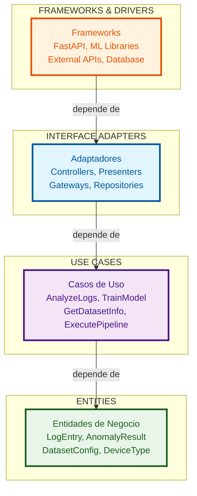
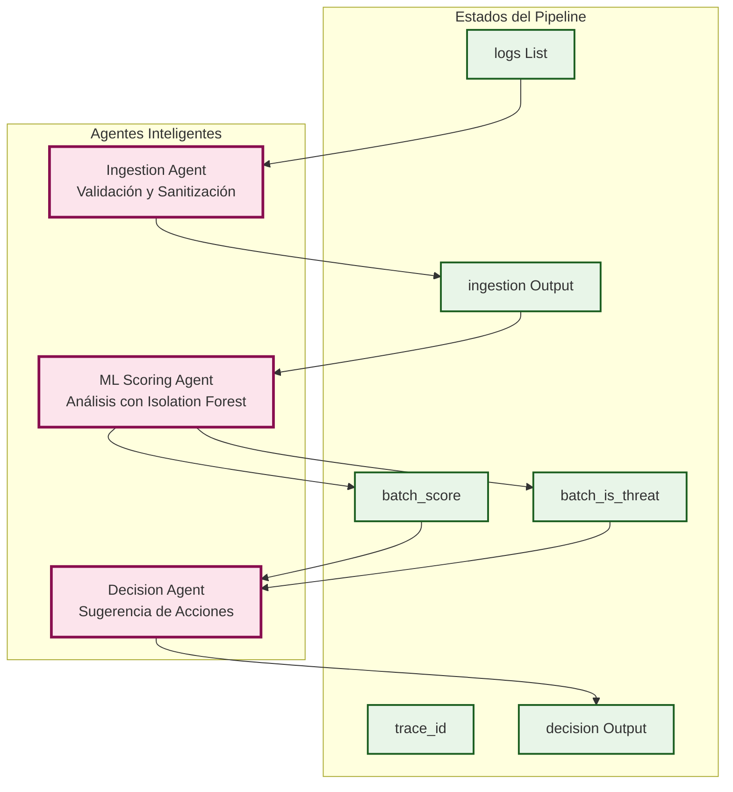
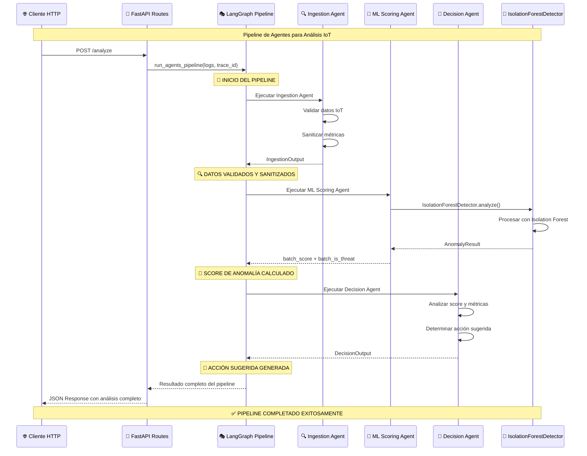
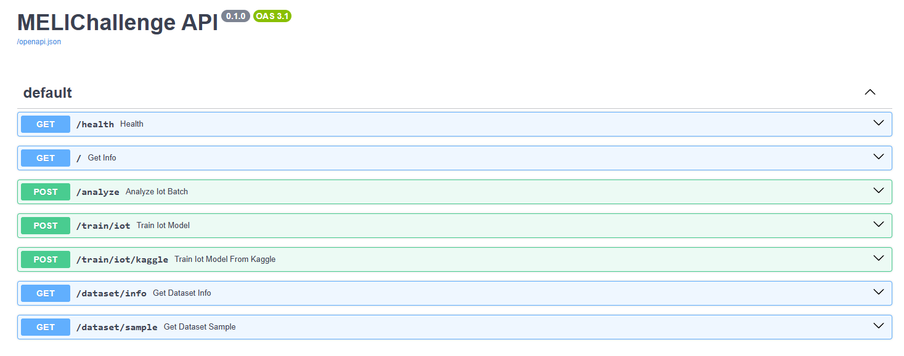
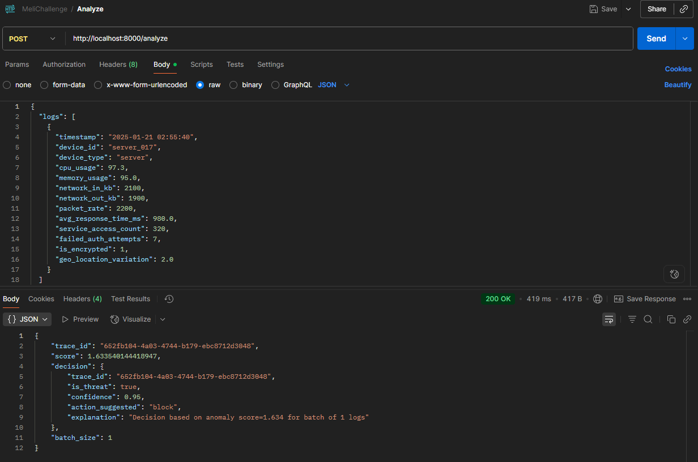
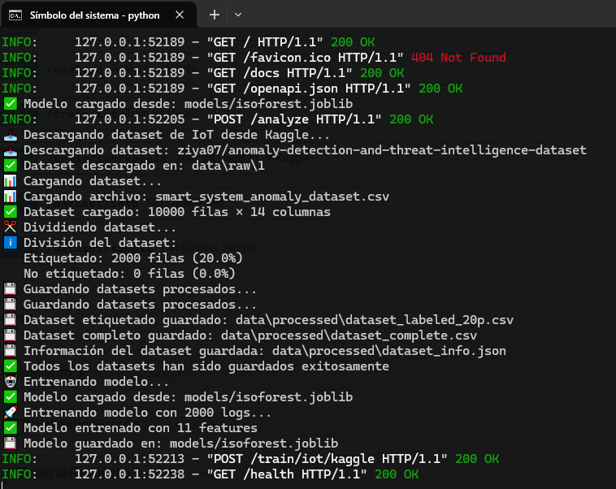

# MeLiChallenge-SecurityIA: Network Session Anomaly Detection API

API FastAPI para detección de anomalías en sesiones de red y comportamiento de autenticación.

## **SOLUCIÓN AL RETO DE MELI - DETECCIÓN INTELIGENTE DE AMENAZAS**

Este proyecto representa mi solución al **Reto de Desarrollo y Seguridad de Mercado Libre (MELI)**, que busca implementar un módulo backend utilizando modelos de Inteligencia Artificial para la detección inteligente de comportamientos anómalos en registros de acceso. El desafío requiere conocimientos en redes, infraestructura, desarrollo de soluciones, IA y bases de datos, implementando una canalización de detección de anomalías con agentes inteligentes que procesen registros y sugieran acciones de seguridad como bloquear, alertar u otra.

## **Dataset de Network Session Anomaly Detection**

Este proyecto ha sido adaptado para trabajar con el dataset **"Cybersecurity Intrusion Detection Dataset"** de Kaggle, que contiene métricas de sesiones de red para la detección de intrusiones y amenazas de seguridad.

### **Características del Dataset:**
- **9,537 registros** de sesiones de red
- **2 clases**: Normal (0), Ataque (1)
- **3 tipos de protocolo**: TCP, UDP, ICMP
- **3 tipos de encriptación**: AES, DES, None
- **5 tipos de navegador**: Chrome, Firefox, Edge, Safari, Unknown
- **Métricas de comportamiento**: Autenticación, duración de sesión, reputación IP, tamaño de paquetes


## Ejecutar Localmente

```bash
# 1. Crear entorno virtual
python -m venv .venv
source .venv/bin/activate   # En Windows: .venv\\Scripts\\Activate

# 2. Instalar dependencias
pip install -r requirements.txt

# 3. Iniciar la API
python wsgi.py  # inicia uvicorn en reload
```

La API estará disponible en: `http://localhost:8000`

## Pruebas

El proyecto incluye pruebas automatizadas organizadas por tipo y alcance.

### **Tipos de Pruebas Disponibles**

| Tipo | Descripción | Comando |
|------|-------------|---------|
| **Unit** | Pruebas de componentes individuales | `python run_tests.py unit` | 
| **Integration** | Pruebas de interacción entre componentes | `python run_tests.py integration` | 
| **E2E** | Pruebas del flujo completo con datos reales | `python run_tests.py e2e` | 
| **All** | Ejecuta todos los tipos de pruebas | `python run_tests.py all` | 

### **Ejecutar Pruebas**

```bash
# Pruebas unitarias
python run_tests.py unit

# Pruebas de integración
python run_tests.py integration

# Pruebas End-to-End
python run_tests.py e2e

# Ejecutar toda la suite
python run_tests.py all

# Reporte de cobertura
python run_tests.py coverage
# Reportes generados en:
# - HTML: htmlcov/index.html
# - XML: coverage.xml
# - Terminal: resumen en consola
```

## **Análisis de Amenazas: STRIDE + MITRE ATT&CK**

Se realizó un **modelado de amenazas** aplicando frameworks de ciberseguridad estándar de la industria:

- **STRIDE**: Para categorización conceptual de amenazas
- **MITRE ATT&CK**: Para mapeo a técnicas reales de atacantes
- **IoC**: Indicadores de compromiso calculables del dataset

### Resultados Clave

- **9 amenazas mapeadas** a técnicas MITRE ATT&CK específicas
- **6 técnicas** identificadas (T1110, T1040, T1041, T1499, T1078, T1087)

### Matriz de Amenazas

| Feature (Dataset) | STRIDE (Categoría) | Amenaza Detectada | MITRE ATT&CK (Técnica) | IoC Propuesto | Estadísticas del Feature |
|-------------------|-------------------|-------------------|------------------------|---------------|--------------------------|
| `failed_logins` | **Spoofing** | Credential Stuffing / Brute Force | **T1110 - Brute Force** | >3 intentos fallidos por sesión | **Min:** 0.00, **Max:** 5.00, **P95:** 3.00 |
| `encryption_used` | **Information Disclosure** | Tráfico sin cifrar interceptado | **T1040 - Network Sniffing** | encryption_used = 'None' + tráfico > umbral | **Valores únicos:** AES: 4,706, DES: 2,865, None: 1,966 |
| `network_packet_size` | **Information Disclosure** | Exfiltración de datos | **T1041 - Exfiltration Over C2** | valores outlier sobre p95 | **Min:** 64.00, **Max:** 1,285.00, **P95:** 830.00 |
| `protocol_type` | **Denial of Service** | Flood de paquetes / Protocol Abuse | **T1499 - Endpoint DoS** | ICMP > 50% + packet_size > p95 | **Valores únicos:** TCP: 6,624, UDP: 2,406, ICMP: 507 |
| `login_attempts` | **Tampering** | Reconnaissance / Account Discovery | **T1087 - Account Discovery** | >5 intentos por sesión | **Min:** 1.00, **Max:** 13.00, **P95:** 7.00 |
| `session_duration` | **Tampering** | Session Hijacking / Persistence | **T1078 - Valid Accounts** | duración outlier sobre p95 o < p5 | **Min:** 0.50, **Max:** 7,190.39, **P95:** 2,312.48 |
| `ip_reputation_score` | **Spoofing** | IP Spoofing / Malicious Sources | **T1078 - Valid Accounts** | score < 0.3 (baja reputación) | **Min:** 0.00, **Max:** 0.92, **P95:** 0.65 |
| `browser_type` | **Spoofing** | User Agent Spoofing | **T1078 - Valid Accounts** | browser_type = 'Unknown' + otros indicadores | **Valores únicos:** Chrome: 5,137, Firefox: 1,944, Edge: 1,469 |
| `unusual_time_access` | **Spoofing** | Account Takeover / Temporal Anomaly | **T1078 - Valid Accounts** | unusual_time_access = 1 + otros indicadores | **Min:** 0.00, **Max:** 1.00, **P95:** 1.00 |

### Detección de Amenazas con IoCs

#### Metodología

Implementamos **Indicadores de Compromiso (IoC)** basados en las reglas de amenazas identificadas:

- **Detección de Fuerza Bruta**: >3 intentos fallidos por sesión
- **Detección de Exfiltración**: Valores outlier sobre percentil 95
- **Detección de Protocol Abuse**: ICMP con paquetes grandes
- **Detección de Reconnaissance**: >5 intentos de login por sesión
- **Detección de Session Hijacking**: Duración anómala de sesiones
- **Detección de IP Spoofing**: Reputación IP < 0.3
- **Detección de User Agent Spoofing**: Navegador desconocido
- **Detección de Temporal Anomaly**: Acceso en horarios inusuales

#### Rendimiento de IoCs

- **Precisión**: 100.0% (Cero falsos positivos)
- **Recall**: 77.8% (Detecta 77.8% de amenazas reales)
- **F1-Score**: 87.5% (Excelente balance)

**[Ver análisis completo y métricas detalladas](notebooks/Threat_Model.ipynb)**


## **ARQUITECTURA DEL PROYECTO**

Este proyecto implementa **Clean Architecture**, con cuatro capas y dependencias que apuntan hacia adentro.

### **Principios fundamentales**

-  **Dependencias apuntan hacia adentro**: Solo las capas externas dependen de las internas  
- **Inversión de dependencias**: Las capas internas definen interfaces, las externas las implementan  
- **Entidades independientes**:  El centro no conoce nada del exterior  
- **Casos de uso aislados**: La aplicación no conoce detalles de frameworks  
- **Interface Adapters**: Adaptadores conectan el interior con el exterior  
- **Frameworks externos**: Detalles técnicos en la capa más externa 

### **Diagrama de arquitectura**



### **🤖 PIPELINE DE AGENTES LANGGRAPH:**

Tu proyecto incluye un sistema de agentes inteligentes que orquesta el análisis de anomalías IoT. Este pipeline implementa **Clean Architecture** manteniendo la separación de responsabilidades.

#### **🎭 ARQUITECTURA DE AGENTES:**



#### **🔄 FLUJO DE EJECUCIÓN DE AGENTES:**



## 🔧 Endpoints Principales

### **🏥 Salud y Información**
- **GET** `/health` → `{ "status": "ok", "dataset": "IoT Anomaly Detection" }`
- **GET** `/info` → Información del proyecto y tipos de dispositivos soportados

### **🔍 Análisis de Anomalías**
- **POST** `/analyze` - Análisis completo con pipeline de agentes
- **POST** `/analyze/iot/direct` - Análisis directo solo con modelo ML

### **🤖 Entrenamiento del Modelo**
- **POST** `/train/iot` - Entrenamiento con datos personalizados
- **POST** `/train/iot/kaggle` - Entrenamiento automático desde Kaggle

### **📊 Gestión de Datasets**
- **GET** `/dataset/info` - Información del dataset procesado
- **GET** `/dataset/sample?size=N` - Muestra del dataset

## 📱 Estructura de Datos IoT

### **Campos Requeridos:**
```json
{
  "timestamp": "2025-01-20 12:00:00",
  "device_id": "thermostat_001",
  "device_type": "thermostat",
  "cpu_usage": 75.5,
  "memory_usage": 60.2,
  "network_in_kb": 150,
  "network_out_kb": 300,
  "packet_rate": 450,
  "avg_response_time_ms": 250.0,
  "service_access_count": 5,
  "failed_auth_attempts": 2,
  "is_encrypted": 1,
  "geo_location_variation": 5.5
}
```

### **Tipos de Dispositivos Soportados:**
- **thermostat**: Termostatos inteligentes
- **smart**: Dispositivos inteligentes generales
- **sensor**: Sensores de monitoreo
- **camera**: Cámaras de seguridad
- **lock**: Cerraduras inteligentes
- **hub**: Hubs centrales
- **appliance**: Electrodomésticos inteligentes
- **wearable**: Dispositivos portátiles

## 🧪 Ejemplos de Uso

### **1. Entrenar el Modelo desde Kaggle**
```bash
curl -X POST http://localhost:8000/train/iot/kaggle
```

**Nota**: El dataset se divide automáticamente en:
- **80% sin etiquetas**: Para entrenamiento no supervisado
- **20% con etiquetas**: Para calibración y optimización de thresholds

**Respuesta:**
```json
{
  "status": "trained_from_kaggle",
  "samples": 1589,
  "model_path": "models/isoforest.joblib",
  "features": 11
}
```

### **2. Analizar Dispositivos IoT**
```bash
curl -X POST "http://localhost:8000/analyze" \
  -H "Content-Type: application/json" \
  -d '{
    "logs": [{
      "timestamp": "2025-01-20 12:00:00",
      "device_id": "thermostat_001",
      "device_type": "thermostat",
      "cpu_usage": 75.5,
      "memory_usage": 60.2,
      "network_in_kb": 150,
      "network_out_kb": 300,
      "packet_rate": 450,
      "avg_response_time_ms": 250.0,
      "service_access_count": 5,
      "failed_auth_attempts": 2,
      "is_encrypted": 1,
      "geo_location_variation": 5.5
    }]
  }'
```

**Respuesta:**
```json
{
  "trace_id": "uuid-12345",
  "score": 0.8234,
  "decision": {
    "trace_id": "uuid-12345",
    "is_threat": true,
    "confidence": 0.85,
    "action_suggested": "alert",
    "explanation": "Decision based on anomaly score=0.8234 for batch of 1 logs"
  },
  "batch_size": 1
}
```

### **3. Obtener Información del Dataset**
```bash
curl http://localhost:8000/dataset/info
```

**Respuesta:**
```json
{
  "total_rows": 10000,
  "labeled_rows": 1589,
  "unlabeled_rows": 8411,
  "columns": ["timestamp", "device_id", ...],
  "label_distribution": {
    "Normal": 1263,
    "Anomaly_DoS": 109,
    "Anomaly_Injection": 109,
    "Anomaly_Spoofing": 108
  },
  "device_type_distribution": {...},
  "anomaly_ratio": 0.205
}
```

## 🔍 Detector ML (Isolation Forest Adaptado)

- **Modelo**: `ml_isolation_forest_detector.py` adaptado para IoT
- **Features**: 11 características numéricas de dispositivos IoT
- **Transformaciones**: Logarítmicas para métricas de red, normalización de porcentajes
- **Persistencia**: Se guarda en `models/isoforest.joblib` y se recarga automáticamente
- **Score**: Rango [0,1] donde valores altos indican mayor anomalía
- **Calibración Automática**: Usa datos etiquetados (20%) para optimizar thresholds

### **Features del Modelo:**
1. **device_type_idx**: Índice del tipo de dispositivo
2. **cpu_norm**: CPU normalizado (0-1)
3. **memory_norm**: Memoria normalizada (0-1)
4. **log_network_in**: Log del tráfico de entrada
5. **log_network_out**: Log del tráfico de salida
6. **log_packet_rate**: Log de la tasa de paquetes
7. **log_response_time**: Log del tiempo de respuesta
8. **log_service_count**: Log del conteo de servicios
9. **log_failed_auth**: Log de intentos fallidos de auth
10. **is_encrypted**: Indicador de encriptación
11. **geo_variation**: Variación de ubicación geográfica

## 🎯 Pipeline de Agentes (LangGraph)

El sistema incluye un pipeline de agentes inteligentes:

1. **Agente de Ingestión**: Valida y sanitiza datos IoT
2. **Agente de ML Scoring**: Ejecuta el modelo de detección
3. **Agente de Decisión**: Sugiere acciones basadas en el score

### **Acciones Sugeridas:**
- **monitor**: Monitorear el dispositivo
- **investigate**: Investigar más a fondo
- **alert**: Enviar alerta de seguridad
- **block**: Bloquear el dispositivo

## 📊 Interpretación de Resultados

### **Score de Anomalía (0-1):**
- **0.0 - 0.3**: Comportamiento normal ✅
- **0.3 - 0.6**: Comportamiento sospechoso ⚠️
- **0.6 - 0.8**: Posible anomalía 🚨
- **0.8 - 1.0**: Anomalía detectada 🚨🚨

### **Calibración Automática:**
El sistema optimiza automáticamente el threshold usando datos etiquetados:
- **Threshold inicial**: 0.5 (configurable)
- **Threshold optimizado**: Se calcula automáticamente para maximizar F1-Score
- **Métricas**: Precisión, Recall y F1-Score se calculan durante la calibración

### **Casos de Uso:**
- **Monitoreo en Tiempo Real**: Análisis continuo de métricas IoT
- **Análisis de Seguridad**: Identificación de ataques DoS, Injection, Spoofing
- **Mantenimiento Predictivo**: Detección de degradación de rendimiento
- **Auditoría de Red**: Análisis de patrones de tráfico anómalos

## 🔧 Configuración Avanzada

### **Logs de la API:**
Los logs se muestran en la consola donde se ejecuta la API.

### **Persistencia del Modelo:**
El modelo entrenado se guarda automáticamente y se recarga en cada reinicio.

### **🧪 Pruebas Manuales (API)**

```bash
# Verificar estado de la API
curl http://localhost:8000/health

# Obtener información del proyecto
curl http://localhost:8000/

# Entrenar modelo con datos de Kaggle
curl -X POST http://localhost:8000/train/iot/kaggle

# Analizar logs de sesión de red
curl -X POST "http://localhost:8000/analyze" \
  -H "Content-Type: application/json" \
  -d '{
    "logs": [{
      "session_id": "session_001",
      "network_packet_size": 150,
      "protocol_type": "TCP",
      "login_attempts": 5,
      "session_duration": 250.0,
      "encryption_used": "AES",
      "ip_reputation_score": 0.8,
      "failed_logins": 2,
      "browser_type": "Chrome",
      "unusual_time_access": 0,
      "attack_detected": 0
    }]
  }'
```

## 📚 Recursos Adicionales

- **Dataset Original**: [Kaggle - IoT Anomaly Detection](https://www.kaggle.com/datasets/ziya07/anomaly-detection-and-threat-intelligence-dataset)
- **Notebook de EDA**: [02_EDA_IoT_Anomaly_Detection.ipynb](notebooks/EDA_IoT_Anomaly_Detection.ipynb)

## 🏗️ Notas de Diseño

- **Capa `domain`**: Contratos y entidades puras (sin dependencias externas)
- **Capa `application`**: Casos de uso que orquestan puertos del dominio
- **Capa `infrastructure`**: Implementaciones concretas (adaptadores) de puertos
- **Capa `orchestration`**: Pipeline de agentes LangGraph para análisis inteligente
- **Capa `presentation`**: Framework FastAPI y capa HTTP


---

## 📸 **IMÁGENES DE LA APLICACIÓN FUNCIONANDO**

### **🎯 Capturas de Pantalla de la Aplicación en Acción**

> **Nota**: Las siguientes imágenes muestran la aplicación procesando datos, respondiendo a solicitudes y generando resultados esperados.

#### **🖥️ Interfaz Principal**

*Vista principal de la aplicación FastAPI con endpoints disponibles*

#### **📊 Análisis de Datos IoT**

*Procesamiento de logs IoT y detección de anomalías en tiempo real*

#### **📋 Logs y Debugging**

*Logs de la aplicación mostrando el procesamiento de requests*

---
## 📄 Licencia

Este proyecto está bajo la licencia especificada en el archivo [LICENSE](LICENSE).
