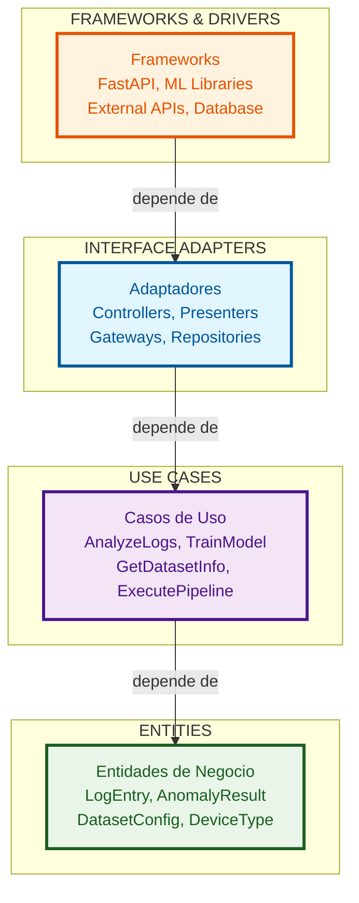
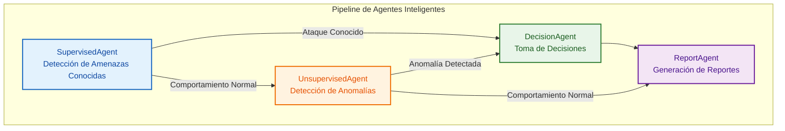
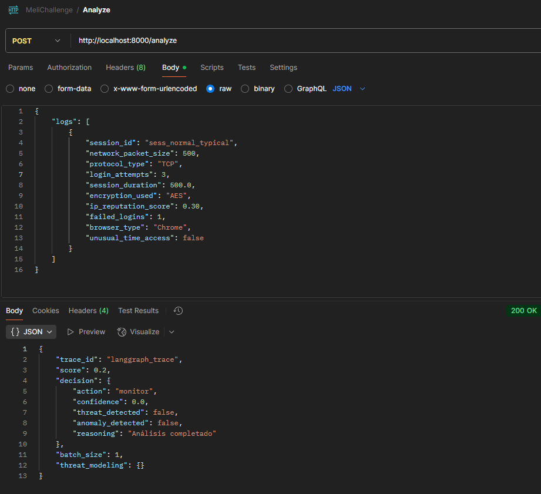
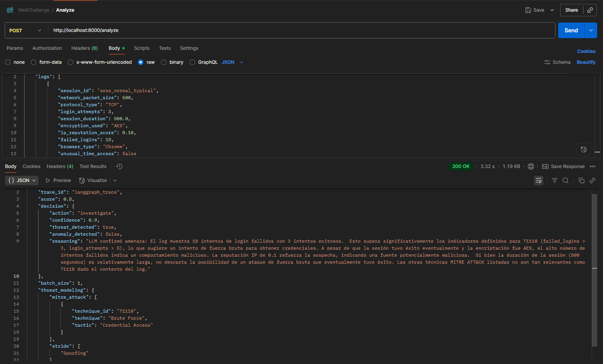

# MeLiChallenge-SecurityIA: Network Session Anomaly Detection API

API FastAPI para detección de anomalías en sesiones de red y comportamiento de autenticación.

## **SOLUCIÓN AL RETO DE MELI - DETECCIÓN INTELIGENTE DE AMENAZAS**

Este proyecto representa mi solución al **Reto de Desarrollo y Seguridad de Mercado Libre (MELI)**, que busca implementar un módulo backend utilizando modelos de Inteligencia Artificial para la detección inteligente de comportamientos anómalos en registros de acceso. El desafío requiere conocimientos en redes, infraestructura, desarrollo de soluciones, IA y bases de datos, implementando una canalización de detección de anomalías con agentes inteligentes que procesen registros y sugieran acciones de seguridad como bloquear, alertar u otra.

## **Dataset de Network Session Anomaly Detection**

Este proyecto ha sido adaptado para trabajar con el dataset **"Cybersecurity Intrusion Detection Dataset"** de Kaggle, que contiene métricas de sesiones de red para la detección de intrusiones y amenazas de seguridad.

**[Acceder al Dataset en Kaggle](https://www.kaggle.com/datasets/dnkumars/cybersecurity-intrusion-detection-dataset/data)**

### **Características del Dataset:**
- **9,537 registros** de sesiones de red
- **2 clases**: Normal (0), Ataque (1)
- **3 tipos de protocolo**: TCP, UDP, ICMP
- **3 tipos de encriptación**: AES, DES, None
- **5 tipos de navegador**: Chrome, Firefox, Edge, Safari, Unknown
- **Métricas de comportamiento**: Autenticación, duración de sesión, reputación IP, tamaño de paquetes


## Ejecutar Localmente

### **Configuración de API Key de Gemini**

El sistema utiliza **Google Gemini** para el procesamiento de lenguaje natural en los agentes inteligentes. Necesitas configurar tu API key:

#### **Opción 1: Variable de Entorno (Recomendado)**
```bash
# Windows (PowerShell)
$env:GEMINI_API_KEY="tu_api_key_aqui"

# Windows (CMD)
set GEMINI_API_KEY=tu_api_key_aqui

# Linux/Mac
export GEMINI_API_KEY="tu_api_key_aqui"
```

#### **Opción 2: Archivo de Configuración**
```bash
# 1. Copia la plantilla de configuración
cp api_config_dev.py api_config.py

# 2. Edita el archivo api_config.py y reemplaza:
GEMINI_API_KEY = "tu_gemini_api_key_aqui"  # Con tu API key real
```

**Nota**: El archivo `api_config.py` está en `.gitignore` para proteger tu API key.

#### **Obtener tu API Key de Gemini**
1. Ve a [Google AI Studio](https://makersuite.google.com/app/apikey)
2. Inicia sesión con tu cuenta de Google
3. Crea una nueva API key
4. Copia la key generada

### **Instalación y Ejecución**

```bash
# 1. Crear entorno virtual
python -m venv .venv
source .venv/bin/activate   # En Windows: .venv\\Scripts\\Activate

# 2. Instalar dependencias
pip install -r requirements.txt

# 3. Configurar API key (elegir una opción)
# Opción A: Variable de entorno
export GEMINI_API_KEY="tu_api_key_aqui"

# Opción B: Archivo de configuración
cp api_config_dev.py api_config.py
# Editar api_config.py y reemplazar "tu_gemini_api_key_aqui" con tu key real

# 4. Verificar configuración
python api_config.py

# 5. Iniciar la API
python wsgi.py  # inicia uvicorn en reload
```

La API estará disponible en: `http://localhost:8000`

## Pruebas

El proyecto incluye pruebas automatizadas organizadas por tipo y alcance.

### **Tipos de Pruebas Disponibles**

| Tipo | Descripción | Comando |
|------|-------------|---------|
| **Unit** | Pruebas de componentes individuales | `python run_tests.py unit` | 
| **Integration** | Pruebas de interacción entre componentes | `python run_tests.py integration` | 
| **E2E** | Pruebas del flujo completo con datos reales | `python run_tests.py e2e` | 
| **All** | Ejecuta todos los tipos de pruebas | `python run_tests.py all` | 

### **Ejecutar Pruebas**

```bash
# Pruebas unitarias
python run_tests.py unit

# Pruebas de integración
python run_tests.py integration

# Pruebas End-to-End
python run_tests.py e2e

# Ejecutar toda la suite
python run_tests.py all

# Reporte de cobertura
python run_tests.py coverage
# Reportes generados en:
# - HTML: htmlcov/index.html
# - XML: coverage.xml
# - Terminal: resumen en consola
```

## **Análisis de Amenazas: STRIDE + MITRE ATT&CK**

Se realizó un **modelado de amenazas** aplicando frameworks de ciberseguridad estándar de la industria:

- **STRIDE**: Para categorización conceptual de amenazas
- **MITRE ATT&CK**: Para mapeo a técnicas reales de atacantes
- **IoC**: Indicadores de compromiso calculables del dataset

### Resultados Clave

- **9 amenazas mapeadas** a técnicas MITRE ATT&CK específicas
- **6 técnicas** identificadas (T1110, T1040, T1041, T1499, T1078, T1087)

### Matriz de Amenazas

| Feature (Dataset) | STRIDE (Categoría) | Amenaza Detectada | MITRE ATT&CK (Técnica) | IoC Propuesto | Estadísticas del Feature |
|-------------------|-------------------|-------------------|------------------------|---------------|--------------------------|
| `failed_logins` | **Spoofing** | Credential Stuffing / Brute Force | **T1110 - Brute Force** | >3 intentos fallidos por sesión | **Min:** 0.00, **Max:** 5.00, **P95:** 3.00 |
| `encryption_used` | **Information Disclosure** | Tráfico sin cifrar interceptado | **T1040 - Network Sniffing** | encryption_used = 'None' + tráfico > umbral | **Valores únicos:** AES: 4,706, DES: 2,865, None: 1,966 |
| `network_packet_size` | **Information Disclosure** | Exfiltración de datos | **T1041 - Exfiltration Over C2** | valores outlier sobre p95 | **Min:** 64.00, **Max:** 1,285.00, **P95:** 830.00 |
| `protocol_type` | **Denial of Service** | Flood de paquetes / Protocol Abuse | **T1499 - Endpoint DoS** | ICMP > 50% + packet_size > p95 | **Valores únicos:** TCP: 6,624, UDP: 2,406, ICMP: 507 |
| `login_attempts` | **Tampering** | Reconnaissance / Account Discovery | **T1087 - Account Discovery** | >5 intentos por sesión | **Min:** 1.00, **Max:** 13.00, **P95:** 7.00 |
| `session_duration` | **Tampering** | Session Hijacking / Persistence | **T1078 - Valid Accounts** | duración outlier sobre p95 o < p5 | **Min:** 0.50, **Max:** 7,190.39, **P95:** 2,312.48 |
| `ip_reputation_score` | **Spoofing** | IP Spoofing / Malicious Sources | **T1078 - Valid Accounts** | score < 0.3 (baja reputación) | **Min:** 0.00, **Max:** 0.92, **P95:** 0.65 |
| `browser_type` | **Spoofing** | User Agent Spoofing | **T1078 - Valid Accounts** | browser_type = 'Unknown' + otros indicadores | **Valores únicos:** Chrome: 5,137, Firefox: 1,944, Edge: 1,469 |
| `unusual_time_access` | **Spoofing** | Account Takeover / Temporal Anomaly | **T1078 - Valid Accounts** | unusual_time_access = 1 + otros indicadores | **Min:** 0.00, **Max:** 1.00, **P95:** 1.00 |

### Detección de Amenazas con IoCs

#### Metodología

Implementamos **Indicadores de Compromiso (IoC)** basados en las reglas de amenazas identificadas:

- **Detección de Fuerza Bruta**: >3 intentos fallidos por sesión
- **Detección de Exfiltración**: Valores outlier sobre percentil 95
- **Detección de Protocol Abuse**: ICMP con paquetes grandes
- **Detección de Reconnaissance**: >5 intentos de login por sesión
- **Detección de Session Hijacking**: Duración anómala de sesiones
- **Detección de IP Spoofing**: Reputación IP < 0.3
- **Detección de User Agent Spoofing**: Navegador desconocido
- **Detección de Temporal Anomaly**: Acceso en horarios inusuales

#### Rendimiento de IoCs

- **Precisión**: 100.0% (Cero falsos positivos)
- **Recall**: 77.8% (Detecta 77.8% de amenazas reales)
- **F1-Score**: 87.5% (Excelente balance)

**[Ver análisis completo y métricas detalladas](notebooks/Threat_Model.ipynb)**


## **ARQUITECTURA DEL PROYECTO**

Este proyecto implementa **Clean Architecture**, con cuatro capas y dependencias que apuntan hacia adentro.

### **Principios fundamentales**

-  **Dependencias apuntan hacia adentro**: Solo las capas externas dependen de las internas  
- **Inversión de dependencias**: Las capas internas definen interfaces, las externas las implementan  
- **Entidades independientes**:  El centro no conoce nada del exterior  
- **Casos de uso aislados**: La aplicación no conoce detalles de frameworks  
- **Interface Adapters**: Adaptadores conectan el interior con el exterior  
- **Frameworks externos**: Detalles técnicos en la capa más externa 

### **Diagrama de arquitectura**



### **Agentes**

Este proyecto implementa un sistema de **agentes inteligentes** para la **detección de intrusiones en ciberseguridad**, analizando **tráfico de red y comportamiento de usuario**.

### **Agentes Especializados**

1. **SupervisedAgent**  
   Detecta amenazas conocidas usando patrones y firmas predefinidas.
2. **UnsupervisedAgent**  
   Identifica anomalías no supervisadas aplicando técnicas de machine learning.
3. **DecisionAgent**  
   Toma decisiones de respuesta basadas en reglas dinámicas y confianza del modelo.
4. **ReportAgent**  
   Genera reportes finales con hallazgos, métricas y recomendaciones.

### **Pipeline de agentes**



## ENDPOINTS PRINCIPALES

### **Salud y Información**
- **GET** `/health` → Estado de salud de la API
- **GET** `/` → Información general del proyecto

### **Análisis de Amenazas**
- **POST** `/analyze` → Análisis completo de amenazas con pipeline de agentes inteligentes

### **Entrenamiento de Modelos**
- **POST** `/train/supervised` → Entrenamiento del modelo supervisado
- **POST** `/train/unsupervised` → Entrenamiento del modelo no supervisado

### **Documentación**
- **GET** `/docs` → Documentación Swagger UI interactiva

## ESTRUCTURA DE LOGS

### **Estructura del Request:**
```json
{
    "logs": [
        {
            "session_id": "sess_normal_typical",
            "network_packet_size": 500,
            "protocol_type": "TCP",
            "login_attempts": 3,
            "session_duration": 500.0,
            "encryption_used": "AES",
            "ip_reputation_score": 0.30,
            "failed_logins": 1,
            "browser_type": "Chrome",
            "unusual_time_access": false
        }
    ]
}
```

## **EJEMPLOS**
> **Nota**: Las siguientes imágenes muestran la aplicación procesando datos, respondiendo a solicitudes y generando resultados esperados.
### **1. Análisis Normal (Sin Amenazas)**


*Ejemplo de análisis de sesión normal sin amenazas detectadas*


### **2. Análisis con Amenaza Detectada**


*Ejemplo de análisis de sesión con amenazas detectadas*


## SEGURIDAD Y DEPENDENCIAS

### **Integración con Snyk**

Este repositorio está integrado con **Snyk** para la revisión continua de dependencias y detección de vulnerabilidades de seguridad.

#### **Estado de la Integración:**
- **Repositorio enlazado** a cuenta de Snyk
- **Escaneo automático** de dependencias en cada push/PR
- **Detección de vulnerabilidades** conocidas en librerías Python
- **Recomendaciones de actualización** para paquetes vulnerables
- **Reportes de seguridad** detallados con niveles de severidad

## LICENCIA

Este proyecto está bajo la licencia especificada en el archivo [LICENSE](LICENSE).
